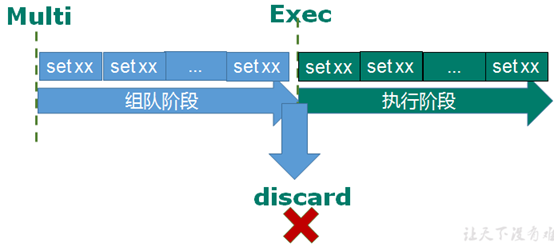
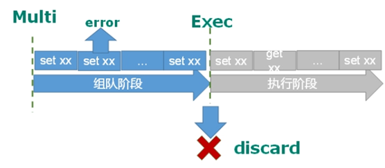
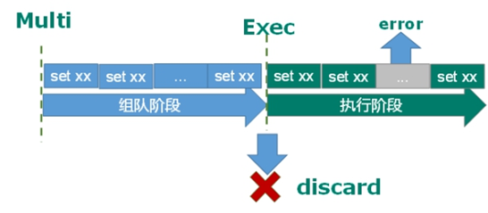
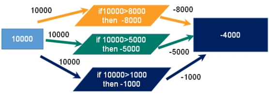
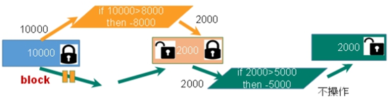
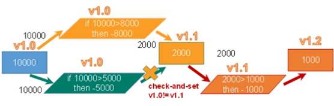

## Redis 事务定义

Redis 事务是一个单独的隔离操作：事务中的所有命令都会序列化、按顺序地执行。事务在执行的过程中，不会被其他客户端发送来的命令请求所打断。

Redis 事务的主要作用就是串联多个命令防止别的命令插队。

Redis 事务中有 Multi、Exec 和 discard 三个指令，在 Redis 中，从输入 Multi 命令开始，输入的命令都会依次进入命令队列中，但不会执行，直到输入 Exec 后，Redis 会将之前的命令队列中的命令依次执行。而组队的过程中可以通过 discard 来放弃组队。

组队中某个命令出现了报告错误，执行时整个的所有队列都会被取消。

如果执行阶段某个命令报出了错误，则只有报错的命令不会被执行，而其他的命令都会执行，不会回滚。

## 事务冲突问题

总金额10000块同时消费了8000，5000，1000，结果为-4000

### ① 悲观锁处理

#### 悲观锁 (Pessimistic Lock)，顾名思义，就是很悲观，每次去拿数据的时候都认为别人会修改，所以每次在拿数据的时候都会上锁，这样别人想拿这个数据就会 block 直到它拿到锁。传统的关系型数据库里边就用到了很多这种锁机制，比如行锁，表锁等，读锁，写锁等，都是在做操作之前先上锁。

### ②乐观锁处理

#### 乐观锁 (Optimistic Lock)，顾名思义，就是很乐观，每次去拿数据的时候都认为别人不会修改，所以不会上锁，但是在更新的时候会判断一下在此期间别人有没有去更新这个数据，可以使用版本号等机制。乐观锁适用于多读的应用类型，这样可以提高吞吐量。Redis 就是利用这种 check-and-set 机制实现事务的。

##### WATCH key [key …]    执行multi前执行此命令开启乐观锁

##### unwatch key          关闭锁

#### Redis 事务三特性

单独的隔离操作 ：事务中的所有命令都会序列化、按顺序地执行。事务在执行的过程中，不会被其他客户端发送来的命令请求所打断。

没有隔离级别的概念 ：队列中的命令没有提交之前都不会实际被执行，因为事务提交前任何指令都不会被实际执行。

不保证原子性 ：事务中如果有一条命令执行失败，其后的命令仍然会被执行，没有回滚 。
