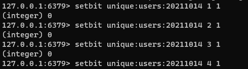
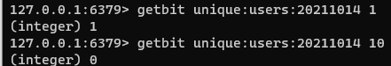

## 一、redis基础命令

keys *        获取当前库下的所有数据

exists key    查看当前键是否存在

type key      查看当前数据类型

del key       删除key

unlink key    删除key,异步删除

expire key 15 设置key过期时间

ttl key       查看key过期剩余时间 -1永久 -2已过期

select 1      切换redis库 0-15

dbsize        查看redis中有多少key

flushdb       清除当前库

flushall      清除所有库

## 二、redis存储String类型数据

String 是二进制安全的，一般用来存储字符串,也可以存储二进制文件，最大支持512M.
String底层的数据结构是简单的动态字符串，类似于ArrayList,占用内存<1M时,每次扩容扩容内存翻倍，>1M时每次扩容+1M，最大512M

set key value					设置key=value

get key						获取键key对应的值

append key value                                追加字符串

getrange key start end			        获取对应key中的子字符串

getset key value		  		新值替换旧值，并返回旧值

getbit key offset				返回存储在键位值的字符串值的偏移

mget key1 [key2..]				获取多个key的值

setbit key offset value			        设置或清除该位在存储在键的字符串值偏移

setex key seconds value			        键到期时设置值

setnx key value					当键不存在的时候设置键的值，存在则无法设置

setrange key offset value		        覆盖字符串的一部分从指定键的偏移

strlen key					得到存储在键的值的长度

mset key value [key value...]	                设置多个键和多个值

msetns key value [key value...]	                设置多个键多个值，存在则无法设置，一个失败全部失败

psetex key milliseconds value	                设置键的毫秒值和到期时间|

incr key					增加键的整数值一次 原子性

incrby key increment			        由给定的数量递增键的整数值

incrbyfloat key increment		        由给定的数量递增键的浮点值

decr key					递减键一次的整数值

decrby key decrement			        由给定数目递减键的整数值

## 三、redis存储List类型数据

存储list结构 可以单键多值，底层是一个有序的双向链表，两端操作性能高

List的数据结构是快速链表quickList。

当list中元素较少时，用的是一块连续的内存存储数据，这个结构是zipList即压缩列表，ziplist将所有的元素紧挨着存储，分配的是一个连续的内存

当元素变多的时候，会改成quicklist存储数据

redis将链表和ziplist结合起来一起使用，也就是将多个ziplist使用双向指针串联起来使用，可以快速的插入或删除数据，同时也不会出现太大的空间冗余

lpush/rpush key value1 [value2 ...]    从左/从右像当前key中插入数据

lrange key [start] [end]               获取范围内的value （0 -1获取全部）

lpop/rpop key                          从左/右获取list中的数据，顺序获取，list中没有数据则键也随之不存在

lindex key [index]                     获取指定下标的数据

llen key                               获取对应key list 长度

linsert key before/after [value] [newValue]  在指定value前面/后面插入数据

lrem key n value                       从左删除n个value

lset key index newValue                将列表key下标为index的替换成newValue

## 四、redis存储Set类型

set 与 list 类似,可以自动排重的, 是 string 类型的无序集合。它底层其实是一个 value 为 null 的 hash 表，所以添加，删除，查找的  复杂度都是 O (1)。

数据结构是 dict 字典，字典是用哈希表实现的。

sadd key value1 [value2...]       将一个或多个元素添加到集合中 已经存在就忽略

smembers key                      取出该集合中的所有值

sismember key value               判断集合key中是否含有该value值

scard key                         返回该集合中的元素个数

srem key value1 [value2...]       删除该集合中的对应元素

spop key                          随机从该集合中取出一个值 删除元素

srandmember key  n                随机从该集合中获取n个值 不会删除元素

sremove source target value       把集合中的值从一个集合移动到另一个集合中

sinter key1 key2                  返回两个集合的交集

sunion key1 key2                  返回两个集合的并集

sdiff key1 key2                   返回两个集合中的差集元素（不包含key2中的）

## 五、redis存储hash

Hash 类型对应的数据结构是两种：ziplist（压缩列表），hashtable（哈希表）。当 field-value 长度较短且个数较少时，使用 ziplist，否则使用 hashtable

hset key filed value [filed value ...]   向集合中添加值，可批量

hget key filed                           获取集合中对应键的值

hmset key filed value [filed value ...]  官方文档说明，已废弃 批量向集合中加值

As per Redis 4.0.0, HMSET is considered deprecated. Please use HSET in new code. 根据Redis 4.0.0，HMSET被视为已弃用。请在新代码中使用HSET。

hexists key filed                        判断集合中对应的键是否存在

hkeys key                                获取集合中的所有键

hvals key                                获取集合中的所有值

hincrby key filed incremnet              为集合中的filed加上增量

hsetnx key filed value                   向集合中设置值，如果filed存在则不添加

## 六、redis有序列表ZSet

数据结构
SortedSet (zset) 是 Redis 提供的一个非常特别的数据结构，一方面它等价于 Java 的数据结构 Map<String, Double>，可以给每一个元素 value 赋予一个权重 score，另一方面它又类似于 TreeSet，内部的元素会按照权重 score 进行排序，可以得到每个元素的名次，还可以通过 score 的范围来获取元素的列表。

zset 底层使用了两个数据结构：

hash，hash 的作用就是关联元素 value 和权重 score，保障元素 value 的唯一性，可以通过元素 value 找到相应的 score 值。

跳跃表，跳跃表的目的在于给元素 value 排序，根据 score 的范围获取元素列表。

跳跃表

有序集合在生活中比较常见，例如根据成绩对学生排名，根据得分对玩家排名等。对于有序集合的底层实现，可以用数组、平衡树、链表等。数组不便元素的插入、删除；平衡树或红黑树虽然效率高但结构复杂；链表查询需要遍历所有效率低。Redis 采用的是跳跃表，跳跃表效率堪比红黑树，实现远比红黑树简单。

从第 2 层开始，1 节点比 51 节点小，向后比较；

21 节点比 51 节点小，继续向后比较，后面就是 NULL 了，所以从 21 节点向下到第 1 层；

在第 1 层，41 节点比 51 节点小，继续向后，61 节点比 51 节点大，所以从 41 向下；

在第 0 层，51 节点为要查找的节点，节点被找到，共查找 4 次。

zadd key member1 score1 member2 score2  ...     将多个元素及其score值放入有序集key中

zrange key start end [withscores]               返回有序集合key中下标start-end的数据 由小到大排序 [withscores 让分数和值一块返回]

zrangebyscore key min max [withscores] [limit offset count]  返回有序集key中 所有score介于min和max之间的数据（包含min和max），结果按照由小到大顺序排列

zrevrangebyscore key min max [withscores] [limit offset count]  返回有序集key中 所有score介于min和max之间的数据（包含min和max），结果按照由大到小顺序排列

zincrby key [incrmnet] [member ]               为元素的score添加增量

zrem key member                                删除该集合下指定值的数据

zcount key min max                             统计该集合在min--max区间内元素个数

zrank key member                               返回该值在集合中的排名，从0开始

## 七、Bitmaps

##### setbit key offest value 设置偏移量的值，返回之前此位置的值

##### getbit key offest 获取bitmap中某个偏移量的值 不存在则返回0

##### bitcount key [start end] 统计字符串从start字节到end字节比特值为1的数量

redis中设置的是bit bitcount统计的是byte

> 转载自：https://www.zhihu.com/question/27672245/answer/123641959

> 这个是SETBIT使用方法的简单说明

> 

> 在redis中，存储的字符串都是以二级制的进行存在的。

> 举例：

> 设置一个　key-value  ，键的名字叫“andy” 值为字符'a'

> 

> 我们知道 'a' 的ASCII码是  97。转换为二进制是：01100001。offset的学名叫做“偏移” 。二进制中的每一位就是offset值啦，比如在这里  offset 0 等于 ‘0’ ，offset 1等于'1' ,offset2等于'1',offset 7 等于'1' ，没错，offset是从左往右计数的，也就是从高位往低位。

> 我们通过SETBIT 命令将 andy中的 'a' 变成 'b' 应该怎么变呢？

> 也就是将 01100001 变成 01100010 （b的ASCII码是98），这个很简单啦，也就是将'a'中的offset 6从0变成1，将offset 7 从1变成0 。

> 

> 大家可能也发现了，每次SETBIT完毕之后，有一个（integer） 0或者（integer）1的返回值，这个是在你进行SETBIT 之前，该offset位的比特值。

> 这个时候，我们再get andy 一下，看看结果：

> 

> 果然，就从'a' 变成 'b'了。

> 这就是redis 中　“SETBIT” 的基本用法。

> BITCOUNT 就是统计字符串的二级制码中，有多少个'1'。 所以在这里，

> BITCOUNT andy    得到的结果就是  3  啦。

> 以上。

##### bitop and(or/not/xor) [destkey] [key ...]

可以获取bitmaps的and(交集) or(并集) not(非) xor(异或) 操作并将结果保存在destkey中

## HyperLogLog

在工作当中，我们经常会遇到与统计相关的功能需求，比如统计网站 PV（PageView 页面访问量），可以使用 Redis 的 incr、incrby 轻松实现。但像 UV（UniqueVisitor 独立访客）、独立 IP 数、搜索记录数等需要去重和计数的问题如何解决？这种求集合中不重复元素个数的问题称为基数问题。

解决基数问题有很多种方案：

数据存储在 MySQL 表中，使用 distinct count 计算不重复个数。

使用 Redis 提供的 hash、set、bitmaps 等数据结构来处理。

以上的方案结果精确，但随着数据不断增加，导致占用空间越来越大，对于非常大的数据集是不切实际的。能否能够降低一定的精度来平衡存储空间？Redis 推出了 HyperLogLog。

Redis HyperLogLog 是用来做基数统计的算法，HyperLogLog 的优点是：在输入元素的数量或者体积非常非常大时，计算基数所需的空间总是固定的、并且是很小的。

在 Redis 里面，每个 HyperLogLog 键只需要花费 12 KB 内存，就可以计算接近 2^64 个不同元素的基数。这和计算基数时，元素越多耗费内存就越多的集合形成鲜明对比。

但是，因为 HyperLogLog 只会根据输入元素来计算基数，而不会储存输入元素本身，所以 HyperLogLog 不能像集合那样，返回输入的各个元素。

什么是基数？

比如数据集 {1, 3, 5, 7, 5, 7, 8}，那么这个数据集的基数集为 {1, 3, 5 ,7, 8}，基数 (不重复元素) 为 5。 基数估计就是在误差可接受的范围内，快速计算基数。

pfadd key element [element ...]    添加数据

pfcount key [key...]  计算基数，可计算多个

pfmarge destkey sourekey 将一个或多个合并

## Geospatial

Redis 3.2 中增加了对 GEO 类型的支持。GEO，Geographic，地理信息的缩写。该类型，就是元素的 2 维坐标，在地图上就是经纬度。redis 基于该类型，提供了经纬度设置，查询，范围查询，距离查询，经纬度 Hash 等常见操作。

geoadd key longitude latitude member [...] 添加经纬度 可多个

geopos key member 获取经纬度

geodist key member1 member2 [m|km|ft|mi] 获取两地距离

georadius key longitude latitude radius [m|km|ft|mi] [WITHCOORD] [WITHDIST] [WITHHASH] [COUNT count [ANY]] 获取以当前经纬度为中心radius为半径的所有
