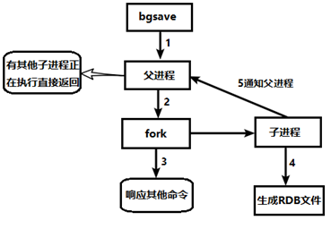
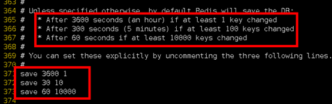
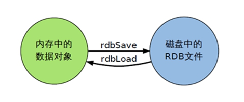
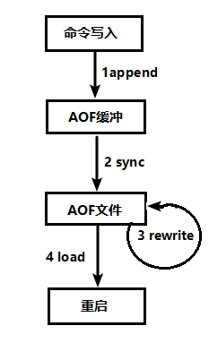
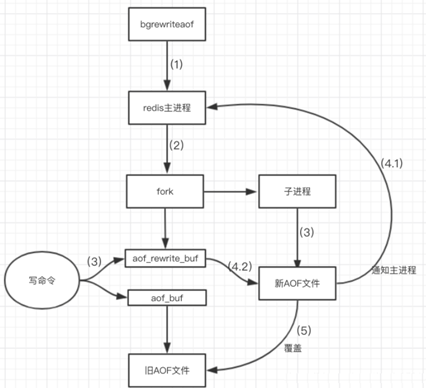

redis默认开启RDB AOF和RDB同时开启，优先AOF

### RDB

简介
在指定的时间间隔内将内存中的数据集快照写入磁盘， 也就是行话讲的 Snapshot 快照，它恢复时是将快照文件直接读到内存里。

Redis 会单独创建（fork）一个子进程来进行持久化，首先会将数据写入到一个临时文件中，待持久化过程都结束了，再用这个临时文件替换上次持久化好的文件。

整个过程中，主进程是不进行任何 IO 操作的，这就确保了极高的性能。

如果需要进行大规模数据的恢复，且对于数据恢复的完整性不是非常敏感，那 RDB 方式要比 AOF 方式更加的高效 。RDB 的缺点是最后一次持久化后的数据可能丢失。

#### Fork

Fork 的作用是复制一个与当前进程一样的进程。新进程的所有数据（变量、环境变量、程序计数器等） 数值都和原进程一致，但是是一个全新的进程，并作为原进程的子进程。

在 Linux 程序中，fork () 会产生一个和父进程完全相同的子进程，但子进程在此后多会 exec 系统调用，出于效率考虑，Linux 中引入了 “写时复制技术”。

一般情况父进程和子进程会共用同一段物理内存，只有进程空间的各段的内容要发生变化时，才会将父进程的内容复制一份给子进程。

#### 持久化过程

##### dump.rdb 文件

在 redis.conf 中配置文件名称，默认为 dump.rdb。

rdb 文件的保存路径，也可以修改。默认为 Redis 启动时命令行所在的目录下 “dir ./”

##### 如何触发 RDB 快照；保持策略

配置文件中默认的快照配置

##### 命令 save VS bgsave

- save ：save 时只管保存，其它不管，全部阻塞。手动保存，不建议。

- bgsave：Redis 会在后台异步进行快照操作， 快照同时还可以响应客户端请求。

- 可以通过 lastsave 命令获取最后一次成功执行快照的时间。

##### flushall 命令

执行 flushall 命令，也会产生 dump.rdb 文件，但里面是空的，无意义。

#### 优势

- 适合大规模的数据恢复

- 对数据完整性和一致性要求不高更适合使用

- 节省磁盘空间

- 恢复速度快

#### 劣势

- Fork 的时候，内存中的数据被克隆了一份，大致 2 倍的膨胀性需要考虑。
- 虽然 Redis 在 fork 时使用了写时拷贝技术，但是如果数据庞大时还是比较消耗性能。
- 在备份周期在一定间隔时间做一次备份，所以如果 Redis 意外 down 掉的话，就会丢失最后一次快照后的所有修改。

##### 如何停止

动态停止 RDB：redis-cli config set save “”#save 后给空值，表示禁用保存策略。

### AOF （append only file）

以日志的形式来记录每个写操作（增量保存），将 Redis 执行过的所有写指令记录下来 (读操作不记录)， 只许追加文件但不可以改写文件，redis 启动之初会读取该文件重新构建数据

换言之，redis 重启的话就根据日志文件的内容将写指令从前到后执行一次以完成数据的恢复工作。

#### AOF 持久化流程

- 客户端的请求写命令会被 append 追加到 AOF 缓冲区内；

- AOF 缓冲区根据 AOF 持久化策略 [always,everysec,no] 将操作 sync 同步到磁盘的 AOF 文件中；

- AOF 文件大小超过重写策略或手动重写时，会对 AOF 文件 rewrite 重写，压缩 AOF 文件容量；

Redis 服务重启时，会重新 load 加载 AOF 文件中的写操作达到数据恢复的目的。

#### AOF 默认不开启

可以在 redis.conf 中配置文件名称默认为 appendonly.aof 文件中开启，AOF 文件的保存路径，同 RDB 的路径一致。

#### AOF 启动、修复、恢复

- AOF 的备份机制和性能虽然和 RDB 不同，但是备份和恢复的操作同 RDB 一样，都是拷贝备份文件，需要恢复时再拷贝到 Redis 工作目录下，启动系统即加载。

##### 正常恢复

- 修改默认的 appendonly no，改为 yes。
- 将有数据的 aof 文件复制一份保存到对应目录 (查看目录：config get dir)。
- 恢复：重启 redis 然后重新加载。

##### 异常恢复

- 修改默认的 appendonly no，改为 yes。
- 如遇到 AOF 文件损坏，通过 /usr/local/bin/ redis-check-aof–fix appendonly.aof 进行恢复。
- 备份被写坏的 AOF 文件。
- 恢复：重启 redis，然后重新加载。

##### AOF 同步频率设置

- appendfsync always：始终同步，每次 Redis 的写入都会立刻记入日志；性能较差但数据完整性比较好。
- appendfsync everysec：每秒同步，每秒记入日志一次，如果宕机，本秒的数据可能丢失。
- appendfsync no：redis 不主动进行同步，把同步时机交给操作系统。

##### Rewrite 压缩

##### Rewrite 压缩是什么

AOF 采用文件追加方式，文件会越来越大为避免出现此种情况，新增了重写机制，当 AOF 文件的大小超过所设定的阈值时，Redis 就会启动 AOF 文件的内容压缩，只保留可以恢复数据的最小指令集，可以使用命令 bgrewriteaof。

###### 重写原理，如何实现重写

AOF 文件持续增长而过大时，会 fork 出一条新进程来将文件重写 (也是先写临时文件最后再 rename)，redis4.0 版本后的重写，是指把 rdb 的快照，以二进制的形式附在新的 aof 头部，作为已有的历史数据，替换掉原来的流水账操作。

###### no-appendfsync-on-rewrite：

如果 no-appendfsync-on-rewrite=yes ，不写入 aof 文件只写入缓存，用户请求不会阻塞，但是在这段时间如果宕机会丢失这段时间的缓存数据。（降低数据安全性，提高性能）

如果 no-appendfsync-on-rewrite=no，还是会把数据往磁盘里刷，但是遇到重写操作，可能会发生阻塞。（数据安全，但是性能降低）

###### 触发机制，何时重写

Redis 会记录上次重写时的 AOF 大小，默认配置是当 AOF 文件大小是上次 rewrite 后大小的一倍且文件大于 64M 时触发。

重写虽然可以节约大量磁盘空间，减少恢复时间。但是每次重写还是有一定的负担的，因此设定 Redis 要满足一定条件才会进行重写。

- auto-aof-rewrite-percentage：设置重写的基准值，文件达到 100% 时开始重写（文件是原来重写后文件的 2 倍时触发）。
- auto-aof-rewrite-min-size：设置重写的基准值，最小文件 64MB。达到这个值开始重写。
- 系统载入时或者上次重写完毕时，Redis 会记录此时 AOF 大小，设为 base_size,
- 如果 Redis 的 AOF 当前大小 >= base_size +base_size*100% (默认) 且当前大小 >=64mb (默认) 的情况下，Redis 会对 AOF 进行重写。
- 例如：文件达到 70MB 开始重写，降到 50MB，下次什么时候开始重写？100MB

##### 重写流程

- bgrewriteaof 触发重写，判断是否当前有 bgsave 或 bgrewriteaof 在运行，如果有，则等待该命令结束后再继续执行；
- 主进程 fork 出子进程执行重写操作，保证主进程不会阻塞；
- 子进程遍历 redis 内存中数据到临时文件，客户端的写请求同时写入 aof_buf 缓冲区和 aof_rewrite_buf 重写缓冲区，保证原 AOF 文件完整以及新 AOF 文件生成期间的新的数据修改动作不会丢失；
- 子进程写完新的 AOF 文件后，向主进程发信号，父进程更新统计信息。主进程把 aof_rewrite_buf 中的数据写入到新的 AOF 文件；
- 使用新的 AOF 文件覆盖旧的 AOF 文件，完成 AOF 重写。

  

##### 优势

- 备份机制更稳健，丢失数据概率更低。

- 可读的日志文本，通过操作 AOF 稳健，可以处理误操作。

##### 劣势

- 比起 RDB 占用更多的磁盘空间。

- 恢复备份速度要慢。

- 每次读写都同步的话，有一定的性能压力。

- 存在个别 Bug，造成恢复不能。

### 总结 (Which one)

##### 用哪个好

官方推荐两个都启用：

- 如果对数据不敏感，可以选单独用 RDB。

- 不建议单独用 AOF，因为可能会出现 Bug。

- 如果只是做纯内存缓存，可以都不用。

##### 官网建议

- RDB 持久化方式能够在指定的时间间隔能对你的数据进行快照存储。
- AOF 持久化方式记录每次对服务器写的操作，当服务器重启的时候会重新执行这些命令来恢复原始的数据，AOF 命令以 redis 协议追加保存每次写的操作到文件末尾。
- Redis 还能对 AOF 文件进行后台重写，使得 AOF 文件的体积不至于过大。
- 只做缓存：如果你只希望你的数据在服务器运行的时候存在，你也可以不使用任何持久化方式。
- 同时开启两种持久化方式：在这种情况下，当 redis 重启的时候会优先载入 AOF 文件来恢复原始的数据，因为在通常情况下 AOF 文件保存的数据集要比 RDB 文件保存的数据集要完整。RDB 的数据不实时，同时使用两者时服务器重启也只会找 AOF 文件。那要不要只使用 AOF 呢？
- 建议不要，因为 RDB 更适合用于备份数据库 (AOF 在不断变化不好备份)，快速重启，而且不会有 AOF 可能潜在的 bug，留着作为一个万一的手段。
- 性能建议：
- - 因为 RDB 文件只用作后备用途，建议只在 Slave 上持久化 RDB 文件，而且只要 15 分钟备份一次就够了，只保留 save 9001 这条规则。
  - 如果使用 AOF，好处是在最恶劣情况下也只会丢失不超过两秒数据，启动脚本较简单，只 load 自己的 AOF 文件就可以了。
  - aof 代价：一是带来了持续的 IO，二是 AOF rewrite 的最后，将 rewrite 过程中产生的新数据写到新文件造成的阻塞几乎是不可避免的。
  - 只要硬盘许可，应该尽量减少 AOF rewrite 的频率，AOF 重写的基础大小默认值 64M 太小了，可以设到 5G 以上。默认超过原大小 100% 大小时重写可以改到适当的数值。
